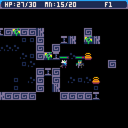
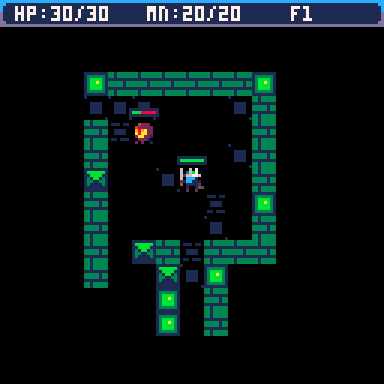
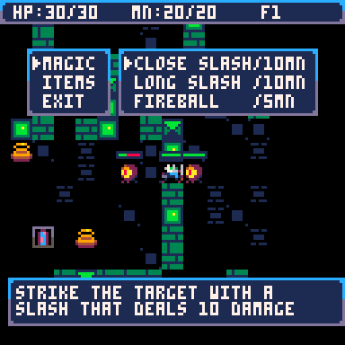
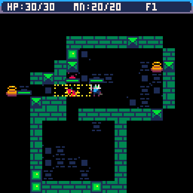
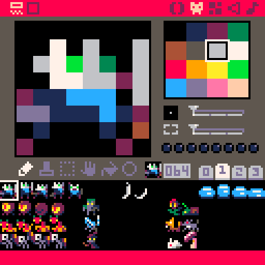

<h1 align="center"> WIP : Pico8 procedural dungeon game </h1>

  
  
  
  

This game is not out yet but I put the dungeons code here for my portfolio.
A pico8 game with currently 1 month and a half of work.
  
- - - - - - - - - - - - - - - - - - - - - - - - - - - - - - - -
For this game I realised : 
- A game with a low level architecture in pico8
- A player that can move in a grid with fluid animations and cast spells in complex menus
- Rogue/PokemonMysterDungeon like dungeons with traps, enemies, breakable pots
- Multiple enemy types with different AIs and pathfinding using Dijsktra algorithm
  
- - - - - - - - - - - - - - - - - - - - - - - - - - - - - - - -
THIS CODE WAS INSPIRED BY BOTH :
- https://www.youtube.com/@LazyDevs
- http://rogueliketutorials.com
  
Credit belongs to them for the inspiration, I analysed both of their code
to then write my own for what I wanted for my game in terms of dungeons.

